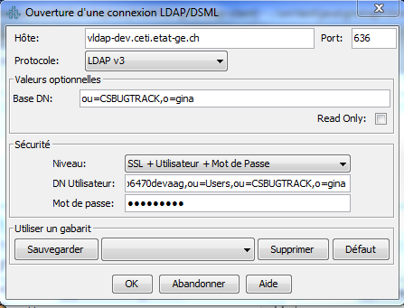
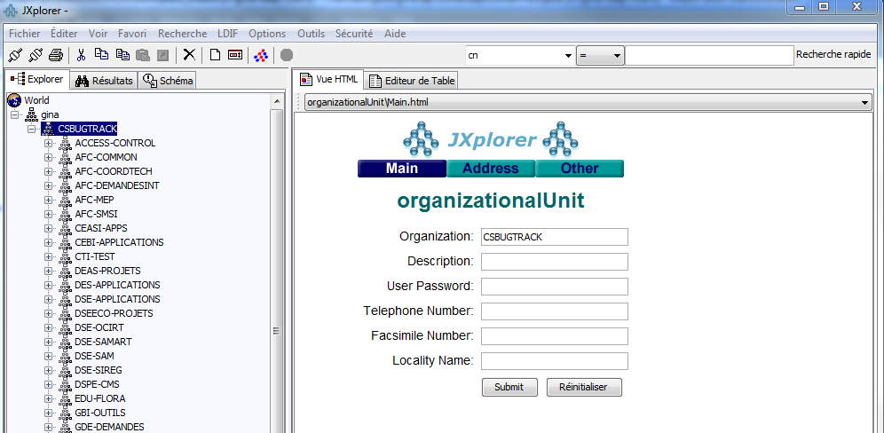

# 1. Propos

La bibliothèque gina-ldap-client est destinée aux applications Java de l'État de Genève.
Elle permet aux applications de se connecter via le protocole LDAP à l'annuaire de l'État et ainsi de récupérer :
- les utilisateurs
- les groupes (rôles)
- l'appartenance des utilisateurs aux groupes.

Cette bibliothèque ne traite que des droits d'accès, pas de l'authentification.

# 2. Description

L'annuaire de l'État de Genève s'appelle Gina. 
Pour une application Java, la manière la plus utilisée pour obtenir une information d'autorisation est d'utiliser
un JAR fourni en interne par l'équipe Gina. 
Ce JAR Gina interne implique que la communication entre l'application cliente et Gina se fait via EJB.

Ce projet-ci permet d'établir la communication via LDAP plutôt qu'EJB. Ses classes implémentent la même
interface ``gina.api.GinaApiLdapBaseAble`` que le JAR Gina interne. 
On notera cependant que, comme Gina n'expose via LDAP qu'une
partie de ses données, de nombreuses méthodes renvoient simplement une exception "méthode non implémentée" -
voir la classe ``gina.impl.GinaLdapCommon``.
A l'inverse, quelques méthodes ont été ajoutées.

Cette bibliothèque peut être intégrée à toute application tournant sur JRE 1.6+.
Elle est construite quasiment sans utilisation de librairies spécifiques, dans un souci de limiter les dépendances.

# 3. Construction

La bibliothèque peut être assemblée via Maven par la commande

```mvn -DskipTest clean install```

Il est cependant utile ne pas sauter les tests unitaires JUnit. 
Ceux-ci peuvent être lancés selon deux modes : "Gina" et "local".

## Mode "Gina"

Dans ce mode, les classes de tests se connectent sur l'annuaire Gina. Ce mode nécessite la
connaissance de mots de passe de Gina.

Dans le POM, ce mode correspond au profil ``etat-de-geneve`` (le profil par défaut) :

```mvn -Dldap.domain.password=<MOT DE PASSE 1> -Dldap.application.password=<MOT DE PASSE 2> -Dldap.gestrepo.password=<MOT DE PASSE 3> clean install```

Les mots de passe sont stockés dans le Keypass du SMIL. S'adresser au SMIL pour les obtenir.

## Mode "local"

Dans ce mode, les classes de tests utilisent des fichiers .ldif fournis.
Pour faire fonctionner les tests, il faut créer des serveurs LDAP locaux, qui exposent les fichiers .ldif fournis ;
cette opération est décrite plus bas, en annexe.
Aucun mot de passe n'est nécessaire.

Dans le POM, ce mode correspond au profil ``local`` :

```mvn -P local,!etat-de-geneve clean install```

Attention : actuellement, certains tests unitaires ne fonctionnent pas dans ce mode.

# 4. Intégration dans une application

## Maven 

```
<dependency>
	<groupId>ch.ge.cti.ct</groupId>
	<artifactId>gina-ldap-client</artifactId>
	<version>${gina-ldap-client.version}</version>
</dependency>
```

## Activation du pooling

Pour utilisation dans une application déployée sur Tomcat ou JBoss.

Il faut ajouter et adapter les propriétés suivantes dans le fichier ``catalina.properties`` :
```
com.sun.jndi.ldap.connect.pool.protocol=plain ssl
com.sun.jndi.ldap.connect.pool.authentication=simple
com.sun.jndi.ldap.connect.pool.maxsize=5
com.sun.jndi.ldap.connect.pool.prefsize=3
com.sun.jndi.ldap.connect.pool.timeout=240000
com.sun.jndi.ldap.connect.pool.initsize=2
#com.sun.jndi.ldap.connect.pool.debug=fine
```

Définition des propriétés : voir https://docs.oracle.com/javase/jndi/tutorial/ldap/connect/config.html.

## Exemples d'utilisation

```
GinaApiLdapConfiguration ldapConf = new GinaApiLdapConfiguration(server, base, user, password, DOMAIN, timeout);
GinaApiLdapBaseAble api = GinaApiLdapBaseFactory.getInstance(ldapConf);
List<String> roles = api.getUserRoles("LAURENTJ");
```

Pour un exemple d'utilisation de toutes les méthodes exposées, se référer :
- aux classes de tests de l'api : ./src/test/java/gina/api
- aux classes de l'appli de démo : http://scm.etat-ge.ch:21080/cti.composant/ct-gina-ldap-client-demo/trunk/ct-gina-ldap-client-demo-war/src/main/java/ch/ge/ael/gina/infos/InfosController.java

# Annexe 1. Serveur LDAP sur un poste de développeur

## Serveur LDAP 

Pour effectuer les tests unitaires en mode local, c'est-à-dire autonome, sans appel à Gina, on utilise les
fichiers .ldif fournis. Pour exposer un fichier .ldif, il faut lancer un serveur LDAP sur ce fichier.
Pour cela, un serveur LDAP [UnboundID](https://ldap.com/unboundid-ldap-sdk-for-java) a été intégré dans 
les sources de ce projet.

Procédure :
- Ouvrir une fenêtre DOS et aller dans le répertoire du projet
- Exécuter les commandes suivantes :

```
cd src\test\resources
unboundid-ldapsdk-4.0.8\tools\in-memory-directory-server --baseDN "ou=CSBUGTRACK,o=gina" --port 30636 --ldifFile ldap_csbugtrack_full.ldif
```

Ceci doit afficher
```
Listening for client connections on port 30636.
```

Note. A ce jour, seule la classe de test ``GinaLdapDomainTest`` peut ainsi être testée. Les autres classes 
``GinaLdapApplicationCtiGestrepoTest``, ``GinaLdapApplicationParallelTest`` et ``GinaLdapApplicationTest``
n'ont pas de fichier .ldif disponible.

## Explorateur LDAP

De façon facultative, on peut lancer un explorateur LDAP sur un serveur LDAP lancé (Gina ou UnboundID).
L'explorateur, par exemple [ApacheDS](http://directory.apache.org/apacheds/downloads.html)
ou [JXplorer](http://www.jxplorer.org), permet de parcourir de façon conviviale un répertoire LDAP.

Procédure pour brancher JXplorer sur Gina :
- Installer JXplorer
- Lancer JXplorer
- Fichier > Se connecter
- Utiliser les paramètres de connexion fournis dans le POM de ce projet





# Annexe 2. Note sur l'usage d'IntelliJ

Pour les développeurs. IntelliJ ne sait pas interpréter ``<testSource>`` dans le POM et lève des erreurs
```
Error:(198, 48) java: lambda expressions are not supported in -source 1.6 (use -source 8 or higher to enable lambda expressions)
```
sur les classes de test, bien que ``<testSource>`` ait été initialisé à ``1.8``.
Pour éviter ces erreurs, aller dans ``Project Structure`` (Ctrl+Alt+Shift+S), puis  dans ``Modules``, puis mettre
``Language level`` à ``8``.

Ces erreurs sont sans conséquence sur le ``mvn install``.
